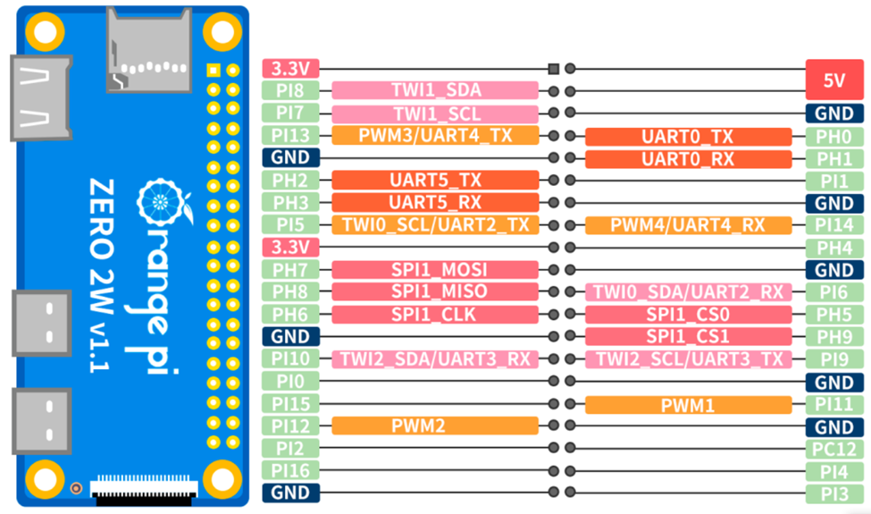
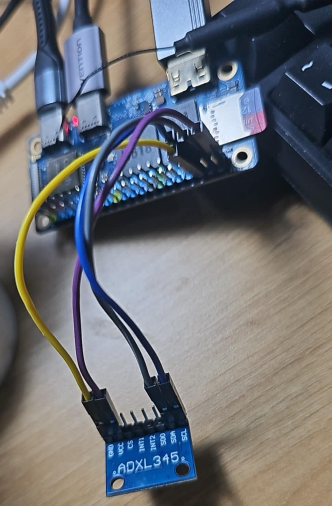
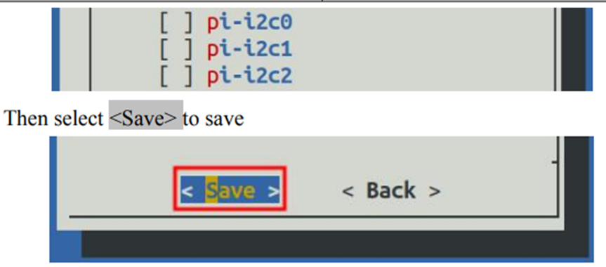
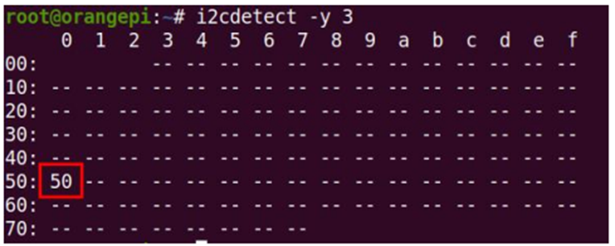
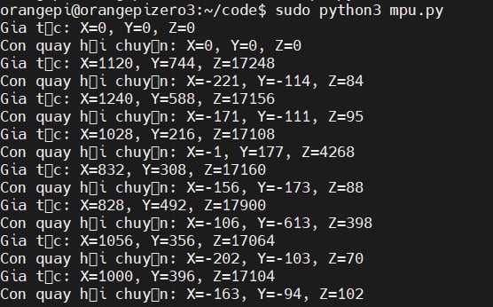

# ADXL345_Orange_Pi

Connecting to i2c-1 interface on orange pi
In menuconfig need to enable i2c-1 interface



Sudo orangepi-config\
->system -> hardware->reboot



Install i2c tools
sudo apt-get install i2c-tools

search for i2c devices on channels
```
i2cdetect -y 1
i2cdetect -y 2
```
i2c address of ADXL234 is 0x53



Install python pip tool
```
sudo apt install python3-pip
```
Install smbus for bus communication with i2c device
```
sudo pip install smbus
```
RUN code
```
python3 read_ADXL345.py
```

